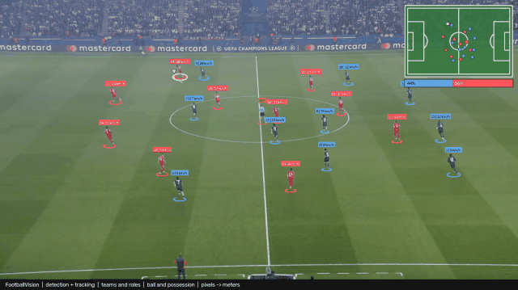
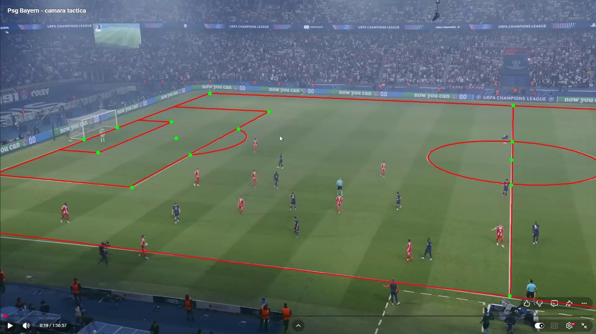
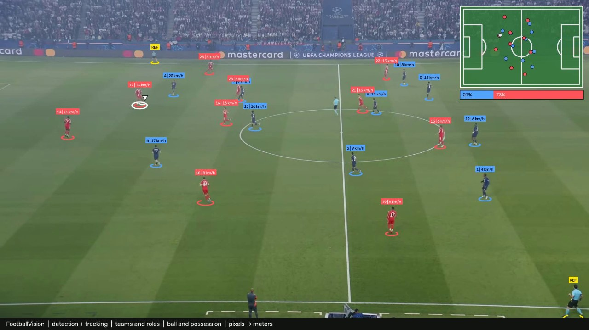
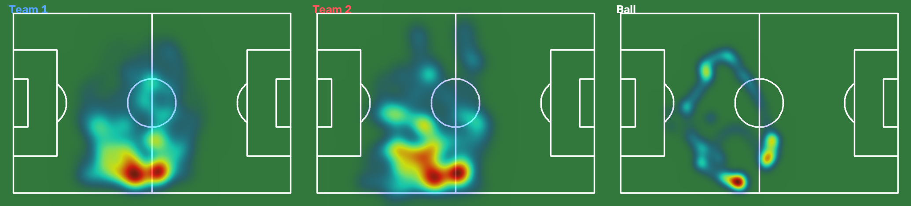

# FootballVision

[](https://github.com/soufiane-tidra/football-vision/actions/workflows/ci.yml)


**AI-powered football match analysis: from broadcast video to player positions, speeds and heatmaps in real-world units.**



*PSG vs Bayern, tactical camera. Players are detected, tracked, split into teams by jersey color and projected onto a 2D pitch in meters, with live speed in km/h.*

> 🚧 **Status: working prototype, under active development.** See the [roadmap](#roadmap).

---

## What it does

| Step | Technique | Output |
|---|---|---|
| 1. Detection | YOLO11 fine-tuned on football (player 0.99 / referee 0.98 / goalkeeper 0.97 / ball 0.74 mAP50) | Players, goalkeepers, referees and the ball |
| 2. Tracking | ByteTrack | Persistent ID per player across frames |
| 3. Teams and roles | Jersey color clustering (3 clusters, brightness down-weighted) + detector vote + pitch position (goal area, touchline) | Team A / Team B, goalkeeper, referee; pitch-side staff removed |
| 3b. Track stitching | Fragments of one person merged by team, time gap and reachable distance | 227 tracker fragments -> 37 people |
| 3c. Ball tracking | Low-confidence candidates on every frame, best physically consistent path by dynamic programming, markings / off-pitch / static / weak stretches rejected, gaps interpolated | Ball position per frame |
| 4. Pitch calibration | Multi-landmark homography (RANSAC), interactive calibration tool, reprojection + leave-one-out validation | Pixel → meter mapping |
| 5. Camera tracking | Sparse optical flow on the pitch + ECC alignment to detected pitch lines, keyframe interpolation | One homography per frame for a panning / zooming camera |
| 6. Movement analytics | Foot-point projection, gap filling, smoothing, physical outlier filtering | Distance (m), speed (km/h), max speed |
| 7. Visualization | OpenCV | Annotated video, live 2D minimap, team heatmaps |

## Results

**Calibration**: predicted pitch lines (red) projected from 15 clicked landmarks onto the frame. Mean reprojection error **0.21 m**, leave-one-out error **0.31 m**.



**Annotated frame**: team colors, track ID, live speed, 2D tactical minimap.



**Team heatmaps** over the demo sequence:



## How it works

```text
match.mp4
   │
   ├─► YOLO11 + ByteTrack ───────────────► tracks.csv (boxes + IDs per frame)
   │
   ├─► Pitch calibration (keyframes) ────► image ↔ pitch homography
   │        └─ camera motion + line alignment ─► homography for every frame
   │
   └─► Feet position ──homography──► (x, y) in meters
             │
             ├─► smoothing ─► distance (m), speed (km/h)
             ├─► jersey colors ─► K-means ─► teams
             └─► annotated video · minimap · heatmaps · stats
```

**Why the feet and not the box center?** The homography maps the *ground plane*. The center of a player's box is about 0.9 m above the ground, which shifts positions by several meters at this camera angle.

**Why smoothing?** About 10 cm of detection jitter per frame at 30 fps would read as 3 m/s of fake speed. Positions are smoothed before differentiating, and physically impossible steps (> 12 m/s) are discarded as tracking errors.

## Quick start

```bash
git clone https://github.com/soufiane-tidra/football-vision.git
cd football-vision
python -m venv venv
venv\Scripts\activate
pip install -r requirements.txt
```

Put a match video at `data/raw/match.mp4` (paths and parameters live in [`configs/default.yaml`](configs/default.yaml)), then:

```bash
python -m scripts.download_player_dataset  # football dataset (needs ROBOFLOW_API_KEY in .env)
python -m scripts.train_detector           # fine-tune YOLO11 -> models/football_detector.pt
python -m scripts.track                    # detection + ByteTrack -> data/processed/tracks.csv
python -m scripts.calibrate_pitch          # click pitch landmarks -> pitch_calibration.json
python -m scripts.test_pitch_mapper        # validate the calibration (errors + overlay)
python -m scripts.compute_homographies     # per-frame homographies for a moving camera
python -m scripts.build_players            # teams, roles, stitched identities -> players.csv
python -m scripts.track_ball               # ball trajectory -> ball.csv
python -m scripts.analyze_movement         # distance / speed per identified player
python -m scripts.make_demo                # annotated video, GIF, heatmaps, stats
```

### Automatic pitch calibration (keypoint model)

Instead of clicking keyframes, a YOLO-pose model detects 32 pitch keypoints in every frame
([Roboflow football-field-detection](https://universe.roboflow.com/roboflow-jvuqo/football-field-detection-f07vi) dataset).
Requires a free Roboflow API key in `.env` (`ROBOFLOW_API_KEY=...`) and a GPU for training.

```bash
python -m scripts.download_pitch_dataset           # dataset -> data/datasets/pitch_keypoints
python -m scripts.check_pitch_dataset              # verify labels match our pitch axes
python -m scripts.train_pitch_keypoints            # YOLO11-pose -> models/pitch_keypoints.pt
python -m scripts.test_pitch_keypoints --frame 600  # inspect detections on one frame
python -m scripts.compute_homographies --method keypoints
```

Each frame's homography is accepted only if enough confident, non-collinear keypoints agree
(RANSAC, < 1 m error). Rejected frames are filled by camera tracking, then homographies are smoothed over time.

### Development

```bash
pip install -r requirements-dev.txt
pytest          # unit tests: homography, landmarks, movement, calibration I/O, teams, config
ruff check .    # lint
```

Tests and lint run automatically on every push with GitHub Actions.

### Calibration tool

`scripts/calibrate_pitch.py` shows the frame next to a 2D pitch map:

- choose a standard landmark (penalty box corner, center spot, …) with `N` / `P`; its coordinates are filled in automatically
- click it in the frame using the built-in magnifier
- predicted pitch lines are drawn live, with the per-point error in meters
- several keyframes are supported (`--frame 600`)

## Project structure

```text
football-vision/
├── src/
│   ├── video/            video info, frame extraction
│   ├── detection/        YOLO detector + ByteTrack tracking
│   ├── tracking/         track data model, CSV loader
│   ├── pitch/            landmarks, homography, calibration I/O,
│   │                     camera motion, projection, drawing
│   ├── classification/   team classification (jersey colors)
│   ├── analytics/        distance, speed
│   ├── visualization/    player markers, minimap, heatmaps
│   └── utils/            configuration loading
├── scripts/              runnable entry points (python -m scripts.<name>)
├── configs/              YAML configuration (paths, pitch size, thresholds)
├── tests/                pytest unit tests
├── .github/workflows/    CI (lint + tests)
├── docs/assets/          README images
└── data/                 raw video, processed outputs (not versioned)
```

## Current limitations

- The detector confuses roles when kit colors differ from its training matches (here the referee and goalkeeper are often labelled `player`); roles are decided by majority vote per track and will be combined with jersey-color clustering.
- The ball is tracked in 75% of the test clip; it is reported as missing rather than guessed when only weak or static candidates exist. Pitch coordinates assume the ball is on the ground (wrong while it is in the air).
- A player who leaves the camera view and returns later gets a new identity (13 identities per team instead of 10 on the test clip); fixing this needs appearance or jersey-number re-identification.
- Speeds depend on calibration quality: homographies are smoothed over 1 s and top speed must be sustained for 0.5 s, which gives realistic values (20-30 km/h) but a standing player still shows about 1 m/s of residual noise.
- Automatic calibration covers every frame but is ~2-2.5 m accurate on this video (domain gap: 222 training images from other stadiums). Manual calibration is ~0.2 m; the demo uses the manually verified 10-second segment.
- No ball tracking yet.

## Roadmap

- [x] Video processing and frame extraction
- [x] Player detection (YOLO11) and multi-object tracking (ByteTrack)
- [x] Multi-landmark pitch calibration with validation
- [x] Per-frame homography for a moving camera
- [x] Real-world distance and speed (m, km/h)
- [x] Team classification (unsupervised, jersey colors)
- [x] Annotated video, 2D minimap, heatmaps
- [x] YAML configuration, unit tests, CI (GitHub Actions)
- [x] Automatic pitch calibration: YOLO11-pose pitch keypoint model (pose mAP50 0.995) + line refinement, every frame calibrated
- [ ] Fine-tune the keypoint model on frames from the target video (current accuracy ~2-2.5 m)
- [x] Football-specific detector (player / goalkeeper / referee / ball), per-track role by majority vote
- [x] Teams and roles from color + detector + position, track stitching (227 fragments -> 37 people)
- [ ] Re-identification of players who leave and re-enter the view (appearance / jersey numbers)
- [x] Ball tracking (trajectory search over low-confidence candidates, interpolation)
- [ ] Possession, pass detection, passing networks
- [ ] Sprints, accelerations, team shape and formation analysis
- [ ] PostgreSQL + FastAPI backend, Streamlit dashboard
- [ ] Docker, MLflow, integration tests

## Tech stack

**Computer vision:** Python, OpenCV, NumPy, Ultralytics YOLO11, ByteTrack, homography / RANSAC, optical flow, ECC image alignment, K-means  
**Engineering:** pytest, ruff, GitHub Actions, YAML config  
**Planned:** PyTorch training, FastAPI, PostgreSQL, Streamlit, Plotly, Docker, MLflow

## License

MIT, see [LICENSE](LICENSE).
