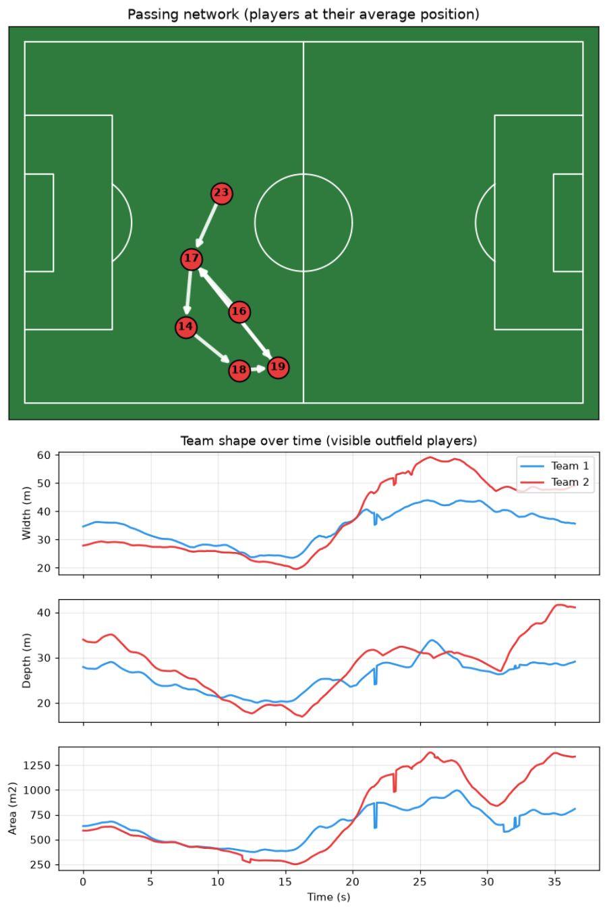

# FootballVision

[](https://github.com/soufiane-tidra/football-vision/actions/workflows/ci.yml)


**AI-powered football match analysis: from broadcast video to identified players, ball, possession, speeds and heatmaps in real-world units.**


*PSG vs Bayern, tactical camera. Fully automatic: players are detected, tracked, assigned to teams and roles, the ball is followed, and everything is projected onto a 2D pitch in meters.*

> 🚧 **Status: working prototype, under active development.** See the [roadmap](#roadmap) and the [limitations](#current-limitations).

---

## What it does

| Step | Technique | Output |
|---|---|---|
| 1. Detection | YOLO11 fine-tuned on football | Players, goalkeepers, referees, ball |
| 2. Tracking | ByteTrack | Track fragments with temporary IDs |
| 3. Pitch calibration | YOLO11-pose model for 32 pitch keypoints, RANSAC homography, alignment to detected pitch lines (ECC), temporal smoothing | Pixel → meter mapping on **every frame** of a panning / zooming camera |
| 4. Teams and roles | Jersey color clustering + detector vote + pitch position | Team A / Team B, goalkeeper, referee; pitch-side staff removed |
| 5. Track stitching | Fragments merged by team, time gap and reachable distance | One identity per person while in view |
| 6. Ball tracking | Low-confidence candidates on every frame, best physically consistent path by dynamic programming, interpolation | Ball position per frame |
| 7. Movement analytics | Foot-point projection, smoothing, physical outlier filtering | Distance, speed, sprints, high-speed running |
| 8. Possession and passes | Ball-to-feet proximity, spell cleaning, event detection | Possession share, passes, turnovers, passing links |
| 9. Team shape | Convex hull of the visible outfield players, offside-line rule | Width, depth, compactness, defensive line height over time |
| 10. Visualization and report | OpenCV, Matplotlib | Annotated video, live 2D minimap, heatmaps, self-contained HTML match report |

## Results on the test clip

36.5 s of a Champions League match, 1096 frames at 1918×1078, filmed by a single camera that pans and zooms.

| Stage | Result |
|---|---|
| Football detector (validation mAP50) | player **0.994**, referee **0.980**, goalkeeper **0.972**, ball **0.744** |
| Pitch keypoint model (validation) | pose mAP50 **0.995** |
| Frames with a valid pitch calibration | **1096 / 1096** |
| Track fragments → identities | **227 → 37** (13 + 13 outfield players, goalkeeper, officials) |
| Outfield players followed for (almost) the whole clip | **16** |
| Ball located | **75%** of frames |
| Possession | 85% / 15%, 7 passes and 6 turnovers detected |
| Speeds | top speeds 20–30 km/h, about 97 m covered per player in 36 s |
| Team shape | about 35 m wide and 27 m deep on average; defensive lines 32 m and 47 m from their own goals |

**Annotated frame**: team colors read from the jerseys, id and live speed, ball marker, player in possession ringed in white, running possession bar, 2D minimap.


**Heatmaps** of both teams and the ball:


**Match report** (`outputs/match/report.html`): passing network and team shape over time, plus team and player tables.



**Manual calibration tool**: predicted pitch lines (red) from 15 clicked landmarks, mean reprojection error **0.21 m**. Used as ground truth to evaluate the automatic calibration.


## How it works

```text
match.mp4
   │
   ├─► YOLO11 (football) + ByteTrack ─────► track fragments
   ├─► YOLO11-pose (32 pitch keypoints) ──► homography per frame ─► refined on pitch lines ─► smoothed
   └─► YOLO11 at low confidence ──────────► ball candidates ─► trajectory search
                                                 │
   fragments + homographies + jersey colors ─────┤
        │                                        │
        ├─► team / role / staff filtering        │
        ├─► stitching ─► players.csv (meters)    │
        │                                        ▼
        └─► movement metrics        possession, passes, turnovers
                       │                         │
                       └────► annotated video · minimap · heatmaps
```

Some design decisions:

- **Feet, not box centers.** The homography maps the ground plane. A box center is about 0.9 m above the ground, which shifts positions by several meters at this camera angle.
- **Roles by majority vote and context.** The detector confuses roles when kits differ from its training matches (here the referee and the goalkeeper are often called "player"). Each identity therefore combines jersey color, the detector's vote over the whole track, and position: whoever stays in a goal area is the goalkeeper, a kit matching neither team is an official, someone standing still at the touchline is staff.
- **Which team defends which goal** is decided with the offside rule: the deepest outfield players in front of a goal belong to the team defending it.
- **The ball is chosen by its trajectory, not its confidence.** At a confidence of 0.05 the detector proposes candidates in 96% of frames, mostly boots, socks and painted marks. Dynamic programming keeps the one continuous, physically possible path; stretches that are weak or never travel are discarded, so the output says "no ball" rather than guessing.
- **Possession is measured in the image**, as ball-to-feet distance relative to the player's height, so it does not depend on calibration accuracy.
- **Speeds are filtered at three levels**: homographies are smoothed over 1 s (the camera moves smoothly, detections jitter), positions are smoothed before differentiating, and a top speed must be sustained for 0.5 s.

## Quick start

```bash
git clone https://github.com/soufiane-tidra/football-vision.git
cd football-vision
python -m venv venv
venv\Scripts\activate
pip install -r requirements-dev.txt
```

A GPU build of PyTorch is recommended (see [pytorch.org](https://pytorch.org/get-started/locally/)).

### 1. Train the two models (once)

Both datasets come from Roboflow Universe (CC BY 4.0) and need a free API key in a `.env` file: `ROBOFLOW_API_KEY=...`

```bash
python -m scripts.download_player_dataset     # players / goalkeepers / referees / ball
python -m scripts.train_detector              # -> models/football_detector.pt

python -m scripts.download_pitch_dataset      # 32 pitch keypoints
python -m scripts.check_pitch_dataset         # verify labels match the pitch axes
python -m scripts.train_pitch_keypoints       # -> models/pitch_keypoints.pt
```

On an RTX 3060 Ti (8 GB) the detector trains in about 25 minutes and the keypoint model in about 20. Use `python -m scripts.train_detector --resume` to continue an interrupted run.

### 2. Analyse a video

Put a match video at `data/raw/match.mp4` (paths and parameters live in [`configs/default.yaml`](configs/default.yaml)), then:

```bash
python -m scripts.run_pipeline
```

which runs these steps in order (each can also be run on its own, or resumed with `--from <step>`):

```bash
python -m scripts.track                                      # detection + ByteTrack -> tracks.csv
python -m scripts.compute_homographies --method keypoints    # pitch calibration per frame
python -m scripts.build_players                              # teams, roles, stitching -> players.csv
python -m scripts.track_ball                                 # ball trajectory -> ball.csv
python -m scripts.analyze_movement                           # distance, speed, sprints
python -m scripts.analyze_possession                         # possession, passes, turnovers
python -m scripts.render_match                               # annotated video, GIF, heatmaps
python -m scripts.build_report                               # team shape + HTML match report
```

The test clip (36 s) takes about 6 minutes end to end on the GPU above; most of it is the line-based calibration refinement.

### Inspection tools

```bash
python -m scripts.test_pitch_keypoints --frame 600    # what the keypoint model sees on one frame
python -m scripts.calibrate_pitch --frame 0           # manual calibration: click landmarks, live line overlay
python -m scripts.test_pitch_mapper                   # reprojection and leave-one-out error of a manual calibration
python -m scripts.compute_homographies                # per-frame homographies from manual keyframes
```

### Development

```bash
pytest          # unit tests
ruff check .    # lint
```

Tests and lint run on every push with GitHub Actions. The analytics core is tested without the heavy detection stack.

## Project structure

```text
football-vision/
├── src/
│   ├── video/            video info, frame extraction
│   ├── data/             dataset download (Roboflow)
│   ├── detection/        YOLO detector + ByteTrack tracking
│   ├── tracking/         track model, loaders, stitching, players.csv I/O
│   ├── pitch/            landmarks, keypoints, homography, calibration,
│   │                     camera motion, projection, drawing
│   ├── classification/   team clustering, identities (team + role)
│   ├── ball/             candidate detection, trajectory search
│   ├── analytics/        movement, possession and events, team shape
│   ├── visualization/    player markers, ball, minimap, heatmaps, report charts
│   └── utils/            configuration loading
├── scripts/              runnable entry points (python -m scripts.<name>)
├── configs/              YAML configuration
├── tests/                pytest unit tests
├── .github/workflows/    CI (lint + tests)
├── docs/assets/          README images
└── data/, models/        video, datasets, outputs, weights (not versioned)
```

## Current limitations

- **Calibration accuracy.** The automatic calibration covers every frame but is about 2–2.5 m accurate on this clip, against 0.2 m for the manual tool. The keypoint model was trained on 222 images from other stadiums. Distances and speeds are therefore indicative: a player standing still still shows about 1 m/s of residual noise.
- **Identities are not permanent.** A player who leaves the camera view and comes back gets a new identity (13 identities per team instead of 10 on the test clip). This needs appearance or jersey-number re-identification.
- **Ball.** Tracked in 75% of the clip. Its pitch position assumes it is on the ground, which is wrong while it is in the air. Passes are detected from possession changes and have not been validated against hand-labelled events.
- **One clip.** All numbers above come from a single 36-second sequence; thresholds were tuned on it.

## Roadmap

- [x] Video processing, football-specific detection, multi-object tracking
- [x] Manual pitch calibration tool with validation
- [x] Automatic pitch calibration (keypoint model, line refinement, smoothing)
- [x] Teams, roles, staff filtering, track stitching
- [x] Ball tracking by trajectory search
- [x] Distance, speed, sprints, high-speed running
- [x] Possession, passes, turnovers, passing links
- [x] Team shape (width, depth, compactness, defensive line height)
- [x] Annotated video, minimap, heatmaps, HTML match report, one-command pipeline
- [x] YAML configuration, unit tests, CI
- [ ] Fine-tune the keypoint model on the target footage for sub-meter calibration
- [ ] Re-identification (appearance / jersey numbers) for permanent player identities
- [ ] Formation detection and pressing metrics
- [ ] Evaluation against hand-labelled events on several matches
- [ ] PostgreSQL + FastAPI backend, Streamlit dashboard
- [ ] Docker, MLflow experiment tracking

## Tech stack

**Computer vision:** Python, PyTorch, Ultralytics YOLO11 (detection and pose), ByteTrack, OpenCV, homography / RANSAC, optical flow, ECC image alignment  
**Analytics and reporting:** NumPy, Matplotlib, self-contained HTML report  
**Algorithms:** K-means clustering, dynamic programming, greedy track association, signal smoothing  
**Engineering:** pytest, ruff, GitHub Actions, YAML configuration  
**Planned:** FastAPI, PostgreSQL, Streamlit, Docker, MLflow

## Acknowledgements

Datasets: [football-players-detection](https://universe.roboflow.com/roboflow-jvuqo/football-players-detection-3zvbc) and [football-field-detection](https://universe.roboflow.com/roboflow-jvuqo/football-field-detection-f07vi) by Roboflow (CC BY 4.0). The pitch keypoint layout follows the Roboflow `sports` project.

## License

MIT, see [LICENSE](LICENSE).
